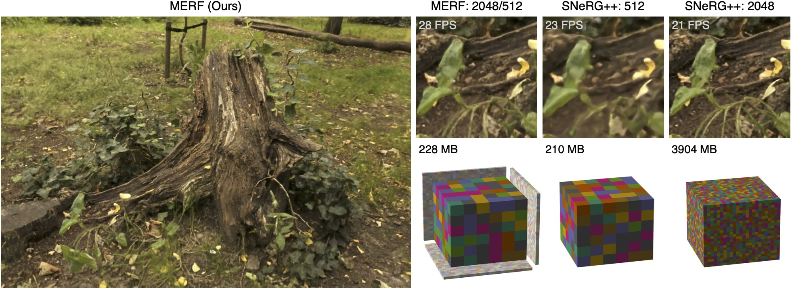

- This is a copy of hte original:

# MERF: Memory-Efficient Radiance Fields for Real-time View Synthesis in Unbounded Scenes

## [Project Page](https://creiser.github.io/merf) | [Video](https://youtu.be/3EACM2JAcxc) | [Arxiv](https://arxiv.org/abs/2302.12249)

[**MERF:
Memory-Efficient Radiance Fields for Real-time View Synthesis in
Unbounded Scenes**](https://creiser.github.io/merf). The code is written in
[JAX](https://github.com/google/jax). 



### Abstract
Neural radiance fields enable state-of-the-art photorealistic view synthesis.
However, existing radiance field representations are either too
compute-intensive for real-time rendering or require too much memory to scale to
large scenes. We present a Memory-Efficient Radiance Field (MERF) representation
that achieves real-time rendering of large-scale scenes in a browser. MERF
reduces the memory consumption of prior sparse volumetric radiance fields using
a combination of a sparse feature grid and high-resolution 2D feature planes.
To support large-scale unbounded scenes, we introduce a novel contraction
function that maps scene coordinates into a bounded volume while still allowing
for efficient ray-box intersection. We design a lossless procedure for baking
the parameterization used during training into a model that achieves real-time
rendering while still preserving the photorealistic view synthesis quality of a
volumetric radiance field.

### Installation 

#### CUDA problem 1) nvcc -V does not output

- remove all other installations, as root execute following (https://forums.developer.nvidia.com/t/cuda-install-unmet-dependencies-cuda-depends-cuda-10-0-10-0-130-but-it-is-not-going-to-be-installed/66488/5):

```
apt clean
apt update
apt purge cuda
apt purge nvidia-*
apt autoremove
apt install cuda
```

reinstall **CUDA 11.8 toolkit** from zero:

```
wget https://developer.download.nvidia.com/compute/cuda/repos/ubuntu2204/x86_64/cuda-ubuntu2204.pin
sudo mv cuda-ubuntu2204.pin /etc/apt/preferences.d/cuda-repository-pin-600
wget https://developer.download.nvidia.com/compute/cuda/11.8.0/local_installers/cuda-repo-ubuntu2204-11-8-local_11.8.0-520.61.05-1_amd64.deb

sudo dpkg -i cuda-repo-ubuntu2204-11-8-local_11.8.0-520.61.05-1_amd64.deb
sudo cp /var/cuda-repo-ubuntu2204-11-8-local/cuda-*-keyring.gpg /usr/share/keyrings/

sudo apt-get update
sudo apt-get -y install cuda-11.8

export PATH=/usr/local/cuda-11.8/bin${PATH:+:${PATH}}
export LD_LIBRARY_PATH="/usr/local/cuda-11.8/lib64:$LD_LIBRARY_PATH"
export CUDA_HOME=/usr/local/cuda-11.8
```

- reboot

#### installation problem 2) edit requirements.txt
- remove from requirements.txt:
```
jax[cuda11_pip] @ https://storage.googleapis.com/jax-releases/jax_cuda_releases.html
```

- add tensorflow version : tensorflow==2.9.0
  
- Create conda environment:

`conda create --name merf python=3.9 pip`

- Activate conda environment:
  
`conda activate merf`

- Install Python dependencies:
  
`pip install -r requirements.txt`

- Install pycolmap:
  
`git clone https://github.com/rmbrualla/pycolmap.git ./internal/pycolmap`

#### jax problem 1) Could not load library libcublasLt.so.12. (https://github.com/google/jax/issues/14931)
- jax wants the version 12 (for CUDA 12) although we have CUDA 11.8
- in fact it wants the right version libcudnn8=8.6 but because it does not find, it defaults to the 12 (stupid :)

**solution**
- check libcudnn version :

`apt list --installed | grep cudnn`
or
`dpkg -l | grep cuda`

- remove any other libcudnn versions that do not match (https://stackoverflow.com/questions/55574034/how-to-delete-cudnn-from-ubuntu) :

```
dpkg -l | grep cuda
sudo dpkg --remove libcudnn9-cuda-11 libcudnn9-dev-cuda-11 libcudnn9-static-cuda-11
```

- install the appropriate lbcudnn version (https://docs.nvidia.com/deeplearning/cudnn/archives/cudnn-860/install-guide/index.html#:~:text=2.3.4.1.%C2%A0Ubuntu%20Network%20Installation): 

```
sudo apt-get install libcudnn8=8.6.0.*-1+cuda11.8
sudo apt-get install libcudnn8-dev=8.6.0.*-1+cuda11.8
```

- check if it works or not: 

```
>>> import jax.numpy as jnp
>>> a = jnp.arange(4)
Could not load library libcublasLt.so.12. Error: libcublasLt.so.12: cannot open shared object file: No such file or directory
Aborted (core dumped)
```

- if this does not work, the only jax and jaxlib versions that seem to run on the H100 are:

```
pip install --upgrade jaxlib==0.4.14+cuda11.cudnn86 -f https://storage.googleapis.com/jax-releases/jax_cuda_releases.html
pip install jax==0.4.14
```

#### jax problem 2) Failed to load PTX text as a module: CUDA_ERROR_INVALID_IMAGE: device kernel image is invalid
- some help here: https://github.com/google/jax/issues/14438
- **solution** only jax==0.4.14 and jaxlib==0.4.14+cuda11.cudnn86 can run the code correctly on the H100 with CC = 9.0

- H100 has compute capacity of 9.0 (https://en.wikipedia.org/wiki/CUDA#GPUs_supported)
          - how to check the CC (https://stackoverflow.com/questions/40695455/what-utility-binary-can-i-call-to-determine-an-nvidia-gpus-compute-capability)? 
          - `nvidia-smi --query-gpu=compute_cap --format=csv`
- for all jax versions > 0.4.14 I get the error PTX cannot run for CC 9.0 (CC = compute capacity)
- has to stick with jax==0.4.14 otherwise code does not run

#### jax problem 3) jax dependent packages break  
- **problem**: other packages that are jax dependent break: chex, flax, optax, objax
- **solution**: downgrade the other packages that are jax dependent following their version realese websites:

taking the jax==0.4.14 from July 2023: https://github.com/google/jax/releases?page=2
compare it with:
      flax versions https://github.com/google/flax/releases
      chex versions https://github.com/google-deepmind/chex/releases
      optax https://github.com/google-deepmind/optax/releases
      objax versions https://github.com/google/objax/releases

```
jax==0.4.14
jaxlib==0.4.14+cuda11.cudnn86
flax==0.7.0
objax==1.7.0
optax==0.1.7
chex==0.1.82

```
-- jax and jaxlib versions
- only the jax==0.4.14 and work on the H100
https://github.com/google/jax/releases?page=2

### How to run the code?
- Download and unzip mipnerf360 dataset:
  ```
  curl -O http://storage.googleapis.com/gresearch/refraw360/360_v2.zip
  unzip 360_v2.zip
  ```

- Train, bake, evaluate and export to a webviewer-compatible format:\
`./train.sh`\
You can specify the name of the scene that you want to reconstruct, the path
where the dataset is located, and the path to which outputs should be saved
in `./train.sh`
paths to the dataset and the directory outputs should be written to in `train.sh`.
- Download third-party dependencies for the webviewer:
  ```
  cd webviewer
  mkdir -p third_party
  curl https://unpkg.com/three@0.113.1/build/three.js --output third_party/three.js
  curl https://unpkg.com/three@0.113.1/examples/js/controls/OrbitControls.js --output third_party/OrbitControls.js
  curl https://unpkg.com/three@0.113.1/examples/js/controls/PointerLockControls.js --output third_party/PointerLockControls.js
  curl https://unpkg.com/png-js@1.0.0/zlib.js --output third_party/zlib.js
  curl https://unpkg.com/png-js@1.0.0/png.js --output third_party/png.js
  curl https://unpkg.com/stats-js@1.0.1/build/stats.min.js --output third_party/stats.min.js
  ```
- Host the webviewer locally:\
`python -m http-server`

### Adjustments for single GPU training
For the paper we trained all models on nodes with eight V100 GPUs with 16
GiB of VRAM, which takes about two hours per scene. As a result we can use a
very large batch size (2^16). We are aware that most people prefer single GPU
training but with a single GPU such a large batch size leads to OOM errors.
We enabled gradient accumulation by default
(`Config.gradient_accumulation_steps = 8`) to make it possible to train with the
same batch size that was used for the paper on a single GPU. If you have a card
with less than 16 GiB memory you need to increase
`Config.gradient_accumulation_steps`.


